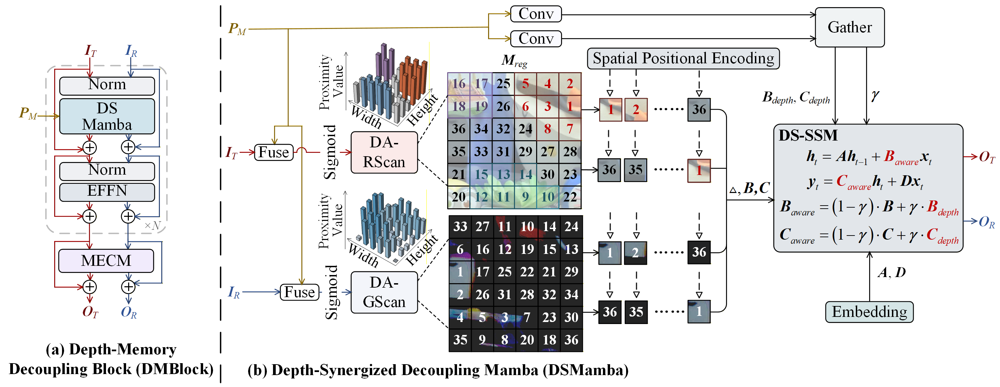

# DMDNet

## Depth-Synergized Mamba Meets Memory Experts for All-Day Image Reflection Separation (AAAI 2026)

> **Paper:** [Link to Paper](***)
> 
> **arXiv Version (with Supplementary Material):** [arXiv](https://arxiv.org/abs/2601.00322)

>**Abstract:** 	Image reflection separation aims to disentangle the transmission layer and the reflection layer from a blended image. Existing methods rely on limited information from a single image, tending to confuse the two layers when their contrasts are similar, a challenge more severe at night. To address this issue, we propose the Depth-Memory Decoupling Network (DMDNet). It employs the Depth-Aware Scanning (DAScan) to guide Mamba toward salient structures, promoting information flow along semantic coherence to construct stable states. Working in synergy with DAScan, the Depth-Synergized State-Space Model (DS-SSM) modulates the sensitivity of state activations by depth, suppressing the spread of ambiguous features that interfere with layer disentanglement. Furthermore, we introduce the Memory Expert Compensation Module (MECM), leveraging cross-image historical knowledge to guide experts in providing layer-specific compensation. To address the lack of datasets for nighttime reflection separation, we construct the Nighttime Image Reflection Separation (NightIRS) dataset. Extensive experiments demonstrate that DMDNet outperforms state-of-the-art methods in both daytime and nighttime.

## 📌 Overview
<p align="center">
  
</p>

# ⚙️Important Requirements
```
python = 3.10+   
torch = 2.1.1+cu118
torchvision = 0.16.1+cu118
torchaudio = 2.1.1+cu118
mamba-ssm = 2.2.2
causal-conv1d = 1.4.0
numpy = 1.26.3
opencv-python = 4.10.0
scikit-image = 0.24.0
pillow = 10.2.0
```

# 🤖Pretrained Model
Download the pretrained models from the links below and place the files into the specified directories.

- **Model_DMDNet:** [Download Link](https://pan.baidu.com/s/1Sr585evoYQRmyMO04rBBPw?pwd=1314)  
- **VGG19 Backbone:** [Download Link](https://pan.baidu.com/s/12YrcZZAL5JVAimX1Pco6tQ?pwd=1314)  
- **Depth Estimation Model:** [Download Link](https://github.com/isl-org/MiDaS/releases/download/v3_1/dpt_next_vit_large_384.pt)

---

**Your project tree should look like:**
```
project_root/
├─ checkpoints/
│  └─ DMDNet/
│     ├─ model_latest.pt   # (example filename)
│     └─ memory_banks_latest.pt   
├─ pretrained/
│  ├─ dpt_next_vit_large_384.pt
│  └─ vgg19-dcbb9e9d.pth
├─ train.py
├─ test.py
└─ ...
```

# 🚀Getting Started
## Train
Run the following command to train the model:

```bash
python train.py
```

## Test
Run the following command to test the model:

```bash
python test.py
```
## Evaluation
Run the following command to evaluate the results:

```bash
python eval.py
```

# 📂 NightIRS Dataset
The NightIRS dataset is available at [Download Link](https://pan.baidu.com/s/1CpFLaYM88tveO4lqH-3Pjw?pwd=1314).

# 🖼️ Results
The output images produced by DMDNet are available at 
[Download Link](https://pan.baidu.com/s/15k-BOf4OaDVCx-c1N0bpQA?pwd=1314).

# 📚 Citation
If you find our work useful, please cite our paper:

```bibtex
***
```
# 🙏 Acknowledgements
We thank [DSIT](https://github.com/mingcv/DSIT) and [MiDaS](https://github.com/isl-org/MiDaS) for their valuable work.

# 📬Contact
If you have any questions, please contact fangsiyanfsy@163.com
